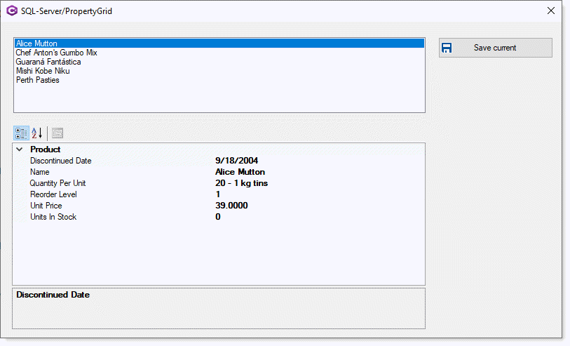

# About

Code sample for reading data from `SQL-Server` database table into a `PropertyGrid` along with save current row in the `PropertyGrid`.

- Note that only enough coding has been done to provide a code base to work from. 
- All database operations are performed in a class against a class rather than using a [DataTable](https://docs.microsoft.com/en-us/dotnet/api/system.data.datatable?view=net-5.0) as a DataTable is overkill for this.
- A [BindingSource](https://docs.microsoft.com/en-us/dotnet/api/system.windows.forms.bindingsource?view=net-5.0) makes life easier, read the docs on BindingSource.
- Uses .NET Framework 4.8, if using .NET Core install the following NuGet package [System.Data.SqlClient](https://www.nuget.org/packages/System.Data.SqlClient/) `currently version 4.8.2`





# Class for PropertyGrid

- No TypeConverter used as they have no value to demo reading and saving data.
- A class is used to present a DateTime Picker which implements [UITypeEditor](https://docs.microsoft.com/en-us/dotnet/api/system.drawing.design.uitypeeditor?view=net-5.0) Interface.
- Several properties should have editors like the date property, again they have no baring on reading and updating.

```csharp
public class Product
{
    [Category("Product"), Browsable(false)]
    public int ProductID { get; set; }
    
    [DisplayName("Name"), Category("Product"), Description("")]
    public string ProductName { get; set; }
    
    [DisplayName("Quantity Per Unit"), Category("Product"), Description("")]
    public string QuantityPerUnit { get; set; }
    
    [DisplayName("Unit Price"), Category("Product"), Description("")]
    public decimal? UnitPrice { get; set; }
    
    [DisplayName("Units In Stock"), Category("Product"), Description("")]
    public short? UnitsInStock { get; set; }
    
    [DisplayName("Reorder Level"), Category("Product"), Description("")]
    public short? ReorderLevel { get; set; }
    
    [Category("Product"), Description("")]
    [DisplayName("Discontinued Date"), 
     EditorAttribute(typeof(DateTimePickerEditor), typeof(UITypeEditor))]
    public DateTime? DiscontinuedDate { get; set; }
    public override string ToString() => ProductName;

}
```
---


Code sample by &nbsp;&nbsp; 